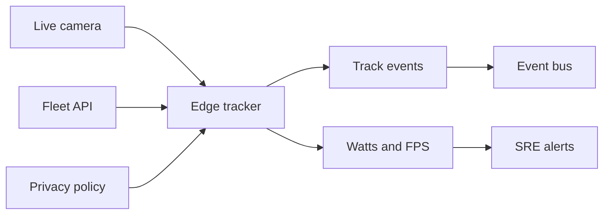

# HerdVista

**Source:** `ai-in-iot/1808.01356v1/`
**Domain:** `ai-iot`
**One-liner:** A battery-first edge vision service that runs deep multiple-object tracking on Jetson-class nodes from the live camera frame only — no cloud round-trip — for outdoor and mobile IoT perception.
**Wedge:** Cities, campuses, and industrial sites that need real-time multi-object tracks on mobile/outdoor poles where coverage is poor and power is budgeted in watts, not rack PDUs.
**Positioning:** Live-frame multi-object tracking for IoT edge nodes. Cloud CV fails the paper’s real-time definition (only the current live frame, no delayed queue). HerdVista productizes Jetson TX2-class deployment (about 5–15 W, Max-Q ~7.5 W efficiency point vs Max-N up to 15 W), onboard camera + wireless, and the dETRUSC-style evaluation discipline for power and frame rate — foreground segmentation plus deep tracking as an operable edge SKU.

## Market research synthesis

### Thesis from source

Visual detection, classification, and tracking sit at the IoT perception layer and need prompt response. The authors define real time as solving the application using only the currently available live camera frame without storing intermediate frames for delayed processing — a requirement cloud computing cannot efficiently meet under latency and poor coverage. Computation therefore moves to the edge. Energy efficiency dominates design for battery-powered mobile and outdoor nodes; energy harvesting is a longer-term possibility.

CNNs deliver robustness and accuracy versus traditional vision tuned to narrow conditions, and VOT challenge winners increasingly use deep learning or deep features. Yet software–hardware gaps remain: power, compute, and memory — with much CNN energy in data movement — block IoT end-node use. There is a lack of end-to-end nodes that capture, process, and communicate. NVIDIA Jetson TX2 is positioned as a practical SoC (roughly 5–15 W; Max-Q peak efficiency near 7.5 W versus Max-N higher performance up to 15 W) with camera and wireless on a battery-powered kit. The work implements low-power real-time deep multi-object tracking, contributes the dETRUSC video dataset from the onboard camera for benchmarking, and reports power and frame-rate feasibility while calling for joint algorithm–hardware CNN design.

### Buyer & economic model

- **Primary buyer:** Head of Smart Infrastructure / Computer Vision Platforms at cities, campuses, logistics yards, and security OEMs.
- **Users:** edge vision engineers, site reliability for outdoor nodes, privacy officers, operations analysts consuming tracks.
- **Budget owner / value metric:** edge node BOM and cellular backhaul budget. Value metrics: watts per node, sustained FPS on live camera, track continuity, % frames processed without cloud offload.
- **Competing status quo:** cloud CV APIs; DVR-then-analyze; single-object trackers; GPU cabinets at the edge that blow power budgets.

### Domain constraints

- **Regulatory / trust / safety:** public-area video is highly regulated; tracking IDs can become de facto personal data.
- **Data sensitivity:** raw video should default to on-node ephemeral processing; only tracks/events leave the node when policy allows.
- **Change-management realities:** outdoor nodes face thermal and battery variability; Max-Q vs Max-N must be operator policy, not a silent firmware default.

## Business requirements

- BR-1: Nodes must process the live camera frame without requiring a cloud round-trip for the primary tracking path.
- BR-2: Deployments must expose power mode (e.g., efficiency vs performance) and report watts and sustained FPS continuously.
- BR-3: Multi-object tracks must remain available when backhaul is degraded; local buffering of track events is allowed, not raw video by default.
- BR-4: Benchmark packs equivalent to dETRUSC-style onboard sequences must be runnable before site acceptance.
- BR-5: Privacy policy must default to emitting tracks/bounding metadata, not continuous raw video upload.
- BR-6: Model packages are versioned; thermal or battery brownout must degrade gracefully (FPS) rather than silently skip detections without health flags.
- BR-7: Operators must set a minimum FPS SLA per site profile; breaches create tickets.
- BR-8: Foreground segmentation and tracker confidence must be inspectable for false-track audits.
- BR-9: Commercial packaging prices by active edge nodes and track-event volume.
- BR-10: Dual-use sites (security + analytics) need purpose limitation per stream.
- BR-11: OTA of vision models must support rollback when FPS or power envelopes break.
- BR-12: Acceptance tests must include battery-powered outdoor runs, not only wall-powered lab benches.

## User stories

Canonical user stories live in sibling [USER_STORIES.md](USER_STORIES.md).

## System design

### Overview

HerdVista manages edge node fleets, deploys deep multi-object tracking packages, enforces power modes, scores live frames on-node, emits track events, runs acceptance benchmarks, and governs privacy retention — with health based on watts and FPS.

### Actors & boundaries

- **Actors:** vision engineers, SREs, analysts, privacy officers, edge nodes, optional cloud event bus.
- **Trust boundary:** raw frames stay on-node by default; the cloud receives track events and health. Model OTA is signed.
- **Human-in-the-loop points:** site acceptance, power-mode policy, privacy purpose approval, model rollback.

### Core capabilities

1. **Node fleet management** — Jetson-class inventory and power modes.
2. **Tracker package deploy** — versioned multi-object tracking stacks.
3. **Live-frame tracking** — on-node inference without cloud dependency.
4. **Track event bus** — IDs, boxes, confidences.
5. **Power/FPS health** — SLA monitoring.
6. **Benchmark acceptance** — onboard sequence packs.
7. **Privacy controls** — retention and purpose limitation.
8. **OTA rollback** — model and config recovery.

### Conceptual data

- **Primary entities:** EdgeNode, PowerProfile, TrackerPackage, TrackEvent, HealthSample, BenchmarkRun, PrivacyPolicy, Deployment.
- **Critical events:** node enrolled, package deployed, FPS SLA breached, brownout degrade, benchmark passed, privacy purpose changed, rollback.
- **Retention / audit needs:** track events retained per purpose; raw video ephemeral; health retained for ops; package manifests immutable.

### Integrations (conceptual)

- **Systems of record:** device management, VMS/analytics consumers, ticketing.
- **Upstream signals:** CSI/USB cameras, battery/fuel-gauge, thermal sensors.
- **Downstream actions:** event webhooks, alerts, optional selective clip export under warrant/policy.

### High-level architecture

### Success metrics

- **Leading:** sustained FPS by power mode; % frames without cloud; benchmark pass rate.
- **Lagging:** node uptime on battery; backhaul cost avoided; track-quality complaints; privacy incidents involving raw video.

## OpenAPI skeleton

Canonical HTTP surface lives in sibling `openapi.yaml`. Summarize here:

- **Base path:** `/v1/...`
- **Auth:** API key and/or Bearer JWT (operator)
- **Resource groups:** Nodes, Packages, Tracks, Health, Privacy
