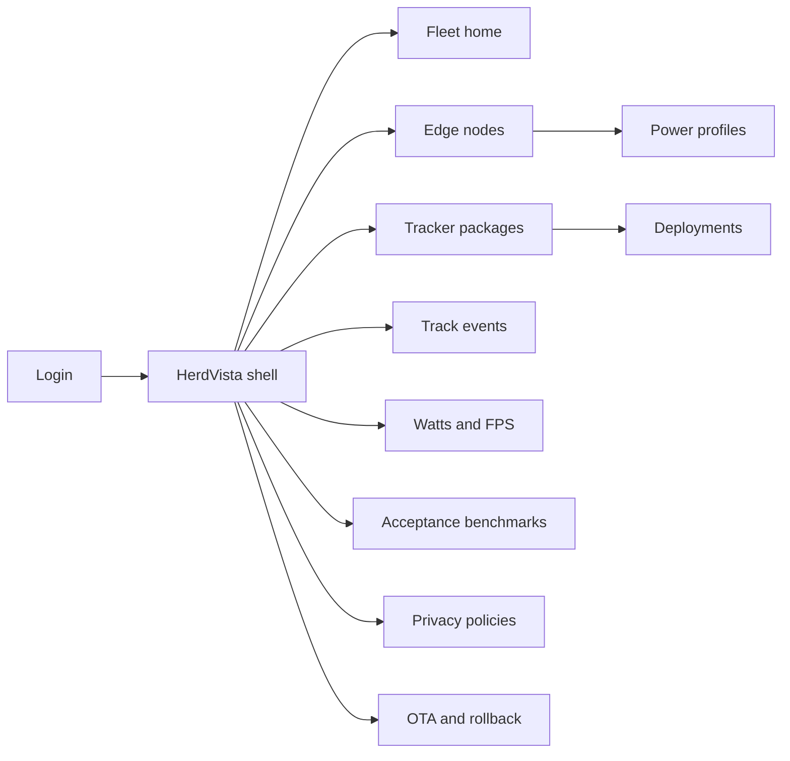
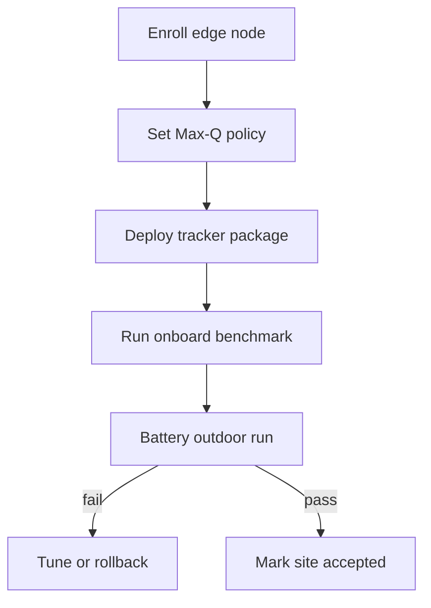
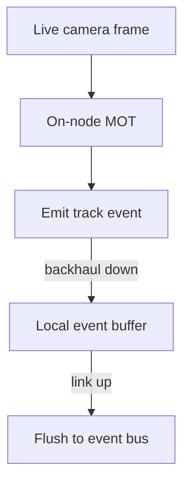

# HerdVista — Web app

**Product:** [PRODUCT.md](./PRODUCT.md)
**Primary surface:** Edge vision fleet console (node power/FPS + track ops)
**Secondary surfaces:** Site acceptance bench report (read-only); privacy purpose attestation page
**Design thesis:** HerdVista is a battery-powered tracking pole, not a cloud CV gallery — the UI metaphor is a live-frame fuel gauge paired with multi-object track ribbons. Visual language is dusk-field olive and amber watt-needles on a deep night-ground: Max-Q feels cool and efficient; Max-N feels hot and expensive; SLA breaches feel like a brownout, not a generic red toast. The brand wordmark sits as a quiet trail mark on every node-health screen so operators know whose watts-per-track contract they are flying.

## UX research synthesis

### Category peers (best-in-class)

- **NVIDIA Jetson / NGC fleet tools:** Power mode (Max-Q vs Max-N), thermal and util telemetry next to model deploy. Steal: power mode as first-class operator policy with continuous watts; reject hiding mode in opaque firmware menus.
- **AWS Panorama / Lookout for Vision edge:** Device enrollment, model packages, inference health. Steal: package version + rollback when envelopes break; reject cloud-round-trip as the default “real-time” path.
- **Frigate NVR / Home Assistant vision:** Local processing, event bus of detections, not continuous raw upload. Steal: tracks/events as the primary artifact; reject DVR-first UX that assumes always-on cloud storage.
- **Verkada / Rhombus (ops side):** Site-centric camera health and review. Steal: site profile FPS SLA and ticket on breach; reject identity-surveillance defaults for public analytics streams.

### Patterns to adopt / reject

- **Adopt:** Watts + sustained FPS as co-primary KPIs; live-frame-only badge on deployments; track-event bus as default egress; dETRUSC-style benchmark before pole climb; ephemeral raw video policy chrome; graceful brownout degrade with health flags; purpose tags per stream.
- **Reject:** Cloud CV playground as home; continuous raw video gallery; single-object tracker aesthetics; GPU-cabinet dashboards that ignore battery; silent FPS skip without flags; purple “AI vision” marketing panels.

### Trust, density, and workflow constraints from PRODUCT.md

Outdoor nodes live on watts and heat (BR-2, BR-6, BR-12): every deploy and health view must show power mode, watts, and FPS together. Real time means live frame only (BR-1, BR-3) — cloud offload cannot look like the happy path. Privacy defaults to tracks/metadata (BR-5, BR-10); purpose limitation must be visible per stream. Acceptance requires onboard benchmarks and battery outdoor runs (BR-4, BR-12), not lab-only green checks. OTA must support rollback when FPS/power envelopes break (BR-7, BR-11).

## Information architecture

### Nav model

### Roles → default home

| Role | Default home | Why |
|------|--------------|-----|
| Edge vision engineer | Tracker packages + deploy | Sustained FPS on Max-Q |
| Site reliability operator | Watts and FPS health | Brownout and SLA (BR-2, BR-7) |
| Operations analyst | Track events explorer | Stable IDs and audits (BR-8) |
| Privacy officer | Privacy policies | Tracks-not-video default (BR-5) |
| Program owner | Fleet home — % frames without cloud | Edge ROI (BR-9) |

### Cross-links to OpenAPI resources

| Nav area | OpenAPI tags / resources |
|----------|---------------------------|
| Edge nodes, power profiles | Nodes |
| Tracker packages, deployments | Packages |
| Track events | Tracks |
| Watts and FPS | Health |
| Privacy policies | Privacy |

## Screen inventory

### Fleet home

- **Purpose:** Answer “are outdoor nodes tracking within watts and FPS without cloud offload?” in one composition.
- **Entry:** Post-login for program owners and engineers.
- **Layout regions:** Brand + site filter; KPI strip (% frames without cloud, nodes in Max-Q, SLA breaches); node map/list hybrid; brownout and OTA alerts rail.
- **Primary actions:** Open unhealthy node; start site acceptance; export ROI vs backhaul.
- **Empty / loading / error:** Empty = enroll first Jetson-class node; loading = skeleton KPIs; error = retry with request id.
- **BR / story ties:** BR-1, BR-9; program owner story.

### Edge node list and detail

- **Purpose:** Inventory Jetson-class nodes with camera, wireless, battery, and thermal context.
- **Entry:** Nodes nav; map pin from home.
- **Layout regions:** Node table (power mode, watts, FPS, battery %); detail with fuel gauge, thermal, camera status, deployment pin, outdoor vs lab flag.
- **Primary actions:** Set power profile; open health history; trigger benchmark; schedule OTA.
- **Empty / loading / error:** Enrollment wizard; telemetry timeout = “node offline / backhaul degraded” with local-buffer note.
- **BR / story ties:** BR-2, BR-3, BR-12.

### Power profile policy

- **Purpose:** Make Max-Q vs Max-N (efficiency vs performance) an explicit operator policy, not silent firmware.
- **Entry:** Node detail; fleet policy.
- **Layout regions:** Mode selector with watts envelope; site default; override audit; expected FPS band.
- **Primary actions:** Apply Max-Q/Max-N; set fleet default; revert override.
- **Empty / loading / error:** Conflict when mode breaks site FPS SLA = blocking confirm.
- **BR / story ties:** BR-2; engineer Max-Q story.

### Tracker package catalog and deploy

- **Purpose:** Versioned deep MOT packages with signed OTA and rollback envelopes.
- **Entry:** Packages nav; deploy from node.
- **Layout regions:** Package list (version, FPS lab/outdoor, power envelope); deploy wizard (node set, power mode, privacy purpose); rollback history.
- **Primary actions:** Deploy; pin version; rollback; compare envelopes.
- **Empty / loading / error:** Envelope fail preview blocks deploy; signed-manifest error is hard stop.
- **BR / story ties:** BR-6, BR-11.

### Track events explorer

- **Purpose:** Consume multi-object track IDs, boxes, confidences — not a raw video wall.
- **Entry:** Tracks nav; webhook debug; analyst home.
- **Layout regions:** Timeline of track events; ID continuity view; confidence and foreground-mask inspect pane; clip export only under policy.
- **Primary actions:** Filter by site/node; open false-track audit; export events; request selective clip (gated).
- **Empty / loading / error:** Empty = waiting for first live tracks; degraded backhaul = buffered local events badge.
- **BR / story ties:** BR-3, BR-5, BR-8; analyst stories.

### Watts and FPS health

- **Purpose:** Continuous power and frame-rate telemetry with SLA breach tickets.
- **Entry:** Health nav; SRE default.
- **Layout regions:** Dual charts (watts, FPS) by node; SLA threshold lines; brownout degrade flags; ticket rail.
- **Primary actions:** Create ticket; open node; force degrade mode; acknowledge brownout.
- **Empty / loading / error:** Missing samples = health gap alert (never silent skip).
- **BR / story ties:** BR-2, BR-6, BR-7.

### Acceptance benchmarks

- **Purpose:** Run dETRUSC-style onboard sequences and battery outdoor runs before site acceptance.
- **Entry:** Bench nav; node “Accept site” CTA.
- **Layout regions:** Benchmark pack picker; run status; power+FPS during run; pass/fail vs site profile; lab vs outdoor checklist.
- **Primary actions:** Start bench; attach outdoor run evidence; mark site accepted; re-run after OTA.
- **Empty / loading / error:** Lab-only pass cannot mark outdoor site accepted (BR-12 gate).
- **BR / story ties:** BR-4, BR-12; engineer acceptance story.

### Privacy policies and purpose tags

- **Purpose:** Default emit tracks/metadata; purpose-limit each stream (security vs analytics).
- **Entry:** Privacy nav; deploy wizard gate.
- **Layout regions:** Policy list; retention (ephemeral raw vs event retention); purpose tags; dual-use conflict warnings.
- **Primary actions:** Approve purpose; set retention; revoke raw-upload exception.
- **Empty / loading / error:** Missing purpose blocks deploy; raw continuous upload requires elevated approval.
- **BR / story ties:** BR-5, BR-10; privacy officer stories.

### OTA and rollback

- **Purpose:** Roll back models when FPS or power envelopes break after OTA.
- **Entry:** Alerts; Packages → history; SRE.
- **Layout regions:** Deployment timeline; envelope breach banner; one-click rollback to last good; blast radius (node count).
- **Primary actions:** Rollback; pause rollout; resume canary.
- **Empty / loading / error:** No prior good version = safe-mode package suggestion.
- **BR / story ties:** BR-11, BR-7.

## Key flows

1. **Enroll and accept outdoor node** — enroll Jetson node → set Max-Q → deploy tracker → run onboard bench + battery outdoor → accept site; failure: lab-only pass cannot accept outdoor site.

2. **Live-frame tracking under degraded backhaul** — node tracks live frames → buffer track events locally → flush when link returns; never require cloud for primary path (BR-1, BR-3).

3. **FPS SLA breach** — health sample below site minimum → ticket → SRE opens watts/FPS → rollback or power-mode change (BR-7).

4. **Privacy purpose change** — dual-use request → officer review → purpose tag update or deny; raw video exception elevated (BR-5, BR-10).

5. **OTA envelope break** — new package drops FPS or exceeds watts → auto-flag → rollback to last good (BR-11).

## Design system

### Tokens (CSS variables)

- `--color-ink: #E8F0E6` — primary text on night ground
- `--color-night-950: #0B120E` — app ground
- `--color-night-900: #142018` — panels
- `--color-night-700: #2A3A30` — rules
- `--color-olive: #8FAE6B` — Max-Q / efficiency confirmation
- `--color-olive-dim: #3F5A2E` — olive on dark
- `--color-amber-watt: #E0A23A` — watts needle / Max-N heat
- `--color-coral: #E06050` — SLA breach / brownout
- `--color-trail: #A8C4B0` — brand / track ribbon accent
- `--color-steel: #7A9088` — secondary labels
- `--font-display: "Source Serif 4", serif` — KPI numerals and site titles (expressive, not Inter)
- `--font-body: "IBM Plex Sans", sans-serif` — console chrome
- `--font-mono: "IBM Plex Mono", monospace` — node ids, package versions, FPS samples
- `--space-1`…`--space-8`: 4px scale
- `--radius-sm: 4px`; `--radius-md: 8px`
- `--motion-needle: 220ms ease-out` — watts needle settle
- `--motion-track-ribbon: 180ms linear` — track ID continuity flash
- `--motion-brownout: 300ms ease-in-out` — coral pulse on SLA breach
- Atmosphere: soft dusk gradient vignette (field green into night), subtle scanline on live health; no purple neon; no stock drone-hero collage in console.

### Typography & brand

- Display serif for watts/FPS hero numerals; body for tables; mono for ids and samples.
- Brand wordmark on every health-bearing view; login hero: brand + one headline (“Tracks from the live frame”) + one CTA.

### Do / don’t

- **Do:** Pair watts with FPS everywhere; badge live-frame-only; default tracks egress; gate outdoor acceptance on battery runs; show brownout degrade flags.
- **Don’t:** Cloud gallery as home; continuous raw video wall; silent detection skips; purple AI glow; pill clusters of vanity CV metrics.

### Accessibility & domain trust cues

- Contrast AA+ on olive/amber/coral against night; SLA breach uses icon + text, not colour alone.
- Live regions announce FPS breaches, brownouts, and rollback completion.
- Focus order: node → power → package → bench → accept.
- Privacy attestation page exposes purpose tags machine-readably.

## Component patterns

- **WattFpsPair** — co-primary telemetry cell with SLA threshold.
- **PowerModeSwitch** — Max-Q / Max-N with envelope preview.
- **LiveFrameOnlyBadge** — deployment path independence from cloud.
- **TrackRibbon** — multi-object ID continuity with confidence.
- **ForegroundMaskInspect** — false-track audit pane.
- **BenchmarkPassGate** — lab vs outdoor acceptance checklist.
- **PurposeTagChip** — stream purpose limitation.
- **EnvelopeRollbackBar** — OTA breach → last good package.

## Out of scope for v1 web

- Cloud CV training studio; full VMS replacement; mobile-native climber app (read-only health OK later); continuous raw video CDN; law-enforcement warrant workflow UI beyond selective clip gate; non-Jetson-class MCU vision; headset AR overlays.
